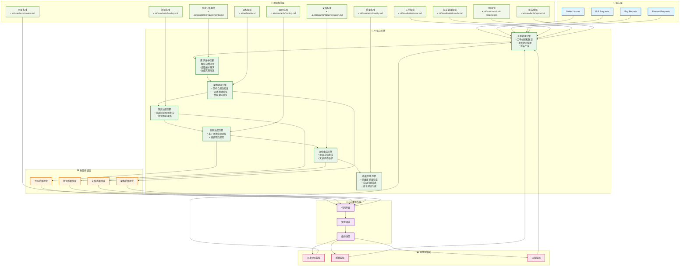

# AIDD 工作流引擎

## 1. 工作流程图

```mermaid
graph TD
    A["🎯 AI 创建工单<br/>读取 .ai/standards/issue.md"] --> A1["📝 创建工单文件<br/>保存到 .ai/issues/"]
    
    A1 --> B["🤖 AI 需求分析<br/>读取 .ai/standards/requirements.md"]
    
    B --> B1["📝 更新工单进度<br/>需求分析完成"]
    
    B1 --> C["🔍 AI 架构验证<br/>读取 .ai/architecture/ 目录"]
    
    C --> C1["📝 更新工单进度<br/>架构验证完成"]
    
    C1 --> D["🌿 AI 创建开发分支<br/>读取 .ai/standards/branch.md"]
    
    D --> D1["📝 更新工单进度<br/>开发分支创建完成"]
    
    D1 --> E["🧪 AI 编写单元测试<br/>读取 .ai/standards/testing.md"]
    
    E --> E1["📝 更新工单进度<br/>单元测试编写完成"]
    
    E1 --> F["💻 AI 编写代码<br/>读取 .ai/standards/coding.md"]
    
    F --> F1["📝 更新工单进度<br/>代码编写完成"]
    
    F1 --> G["📝 AI 文档编写<br/>读取 .ai/standards/documentation.md"]
    
    G --> G1["📝 更新工单进度<br/>文档编写完成"]
    
    G1 --> H["✅ AI 质量检测<br/>读取 .ai/standards/quality.md"]
    
    H --> H1["📝 更新工单进度<br/>质量检测完成"]
    
    H1 --> I{"🔍 质量达标?"}
    
    %% 主流程 - 垂直对齐
    I -->|✅| K["👨‍💻 人类审查<br/>读取 .ai/standards/review.md"]
    K --> L{"🤔 质量达标？"}
    L -->|✅| K1["📝 更新工单进度<br/>人类审核完成"]
    K1 --> O["📊 AI 输出完整报告<br/>读取 .ai/standards/report.md"]
    O --> P["👨‍💻 人类审查<br/>读取 .ai/standards/review.md"]
    P --> Q{"📋 质量达标?"}
    Q -->|✅ 完整| R["🚀 AI 提交PR<br/>读取 .ai/standards/pull-request.md"]
    
    %% 质量问题处理循环 - 侧边分支
    I -->|❌| J["🔧 AI 处理质量问题<br/>修复检测到的问题"]
    L -->|❌| J
    Q -->|❌| O
    J --> H
    
    R --> R1["📝 更新工单进度<br/>PR提交完成"]
    
    R1 --> S["✨ 任务完成<br/>工单状态更新为已完成"]
    
    %% 样式定义
    classDef aiProcess fill:#e1f5fe,stroke:#01579b,stroke-width:2px
    classDef humanProcess fill:#f3e5f5,stroke:#4a148c,stroke-width:2px
    classDef decision fill:#fff3e0,stroke:#e65100,stroke-width:2px
    classDef output fill:#e8f5e8,stroke:#1b5e20,stroke-width:2px
    classDef feedback fill:#fff3e0,stroke:#ff6f00,stroke-width:2px
    
    class A,A1,B,B1,C,C1,D,D1,E,E1,F,F1,G,G1,H,H1,J,K1,O,R,R1 aiProcess
    class K,P humanProcess
    class I,L,Q decision
    class S output
```



## 2. 系统架构图



## 3. 规范文件结构

```
项目根目录/
└── .ai/                             # AI 规范文件根目录
    ├── standards/                   # 📋 规范目录
    │   ├── issue.md                 # 工单创建
    │   ├── requirements.md          # 需求分析
    │   ├── branch.md                # 分支管理
    │   ├── testing.md               # 测试编写
    │   ├── coding.md                # 代码编写
    │   ├── documentation.md         # 文档编写
    │   ├── quality.md               # 质量检测
    │   ├── review.md                # 审查检查
    │   ├── pull-request.md          # PR 提交
    │   └── report.md                # 报告格式
    ├── architecture/                # 🏗️ 架构文档目录
    │   ├── system.md                # 系统架构
    │   └── api.md                   # API 设计
    └── issues/                      # 🎯 工单目录
        └── (存放实际工单文件)
```

## 4. 核心特性

### 开发流程
- **测试驱动开发**: 测试→代码→文档的严格顺序
- **工单驱动**: 全程工单跟踪和状态更新
- **规范引导**: 每阶段都有对应规范文件指导

### 质量保证
- **四层质量检查**: 代码、测试、文档、架构
- **智能反馈**: 问题类型精确回退机制
- **人机协作**: 关键节点人类审查决策

### 应急机制
- **紧急处理通道**: 快速响应重要问题
- **持续监控**: 效率、质量、流程三重监控

## 5. 实施规范

### 工单管理
- 命名格式: `YYYY-MM-DD-功能描述`
- 优先级: 紧急/高/中/低
- 状态跟踪: 待处理→进行中→待审查→已完成

### 流程执行
- 每个重要节点完成后备份
- 所有变更保持清晰提交记录
- 确保文档与代码同步更新

### 紧急处理
- 绕过非关键检查加快响应
- 及时通知相关人员
- 后续补充完整测试和文档