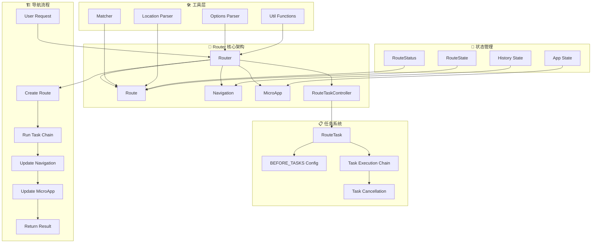
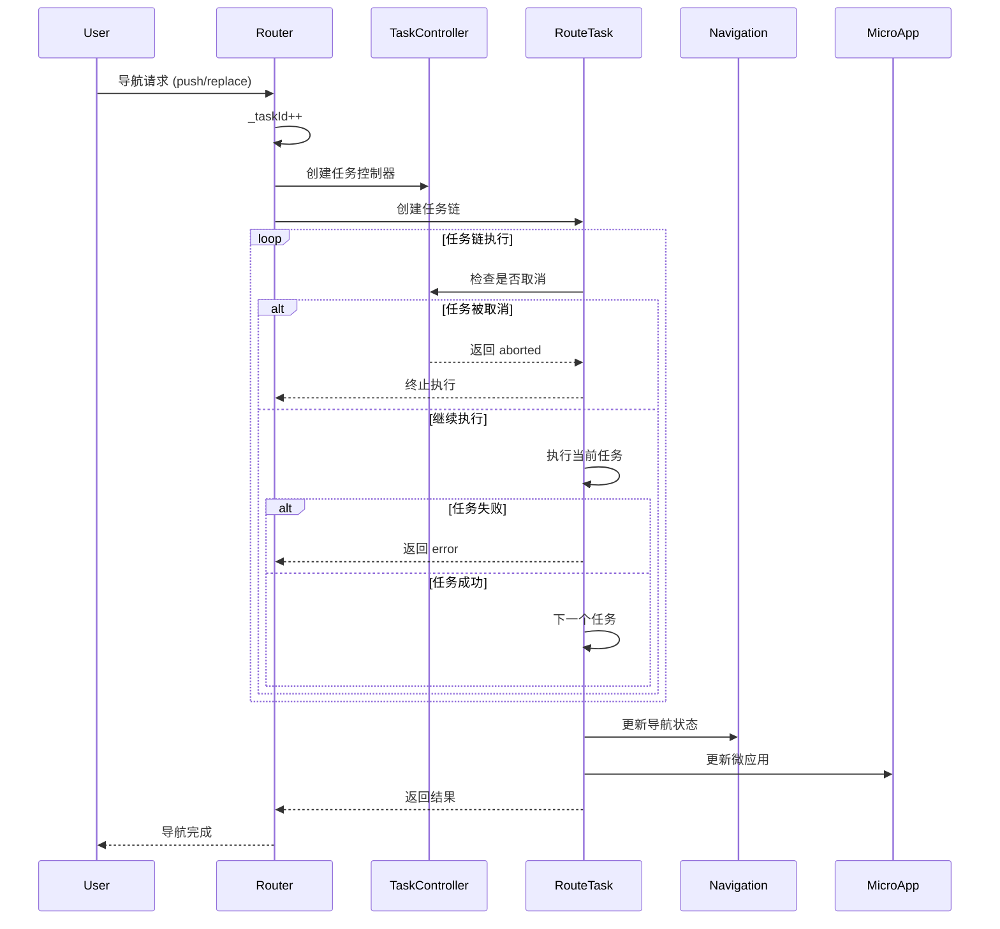

# Router 系统架构设计

## 1. 系统概述

Router 是一个基于任务链式执行的现代路由系统，专为复杂应用场景设计。核心特性包括：任务并发控制、弹层路由、微应用集成、SSR 支持和窗口导航。

## 2. 核心架构

### 2.1 架构层次图


### 2.2 任务执行流程


## 3. 核心模块详解

### 3.1 Router 类 - 路由器核心
**职责**：
- 导航方法管理（push, replace, back, go, forward）
- 任务控制器管理（_taskId, _tasks）
- 全局守卫管理（beforeEach, afterEach）
- 弹层路由管理（createLayer, pushLayer, closeLayer）
- 窗口导航管理（pushWindow, replaceWindow）

**关键属性**：
```typescript
class Router {
    private _taskId: number = 0;           // 任务并发控制
    private _route: Route | null = null;   // 当前路由
    private _tasks: Record<RouteTaskType, RouteConfirmHook>; // 任务映射
    private _guards: { beforeEach: RouteConfirmHook[], afterEach: RouteNotifyHook[] };
    
    readonly navigation: Navigation;        // 导航控制器
    readonly microApp: MicroApp;           // 微应用管理器
}
```

### 3.2 Route 类 - 路由对象
**职责**：
- URL 解析和参数提取
- 路由匹配结果管理
- 状态和元信息管理
- 处理器（handle）管理

**关键属性**：
```typescript
class Route {
    readonly type: RouteType;              // 路由类型
    readonly url: URL;                     // 完整 URL
    readonly path: string;                 // 路径部分
    readonly params: Record<string, string>; // 路径参数
    readonly query: Record<string, string>; // 查询参数
    readonly matched: RouteParsedConfig[]; // 匹配的路由配置
    status: RouteStatus;                   // 路由状态
    handle: RouteHandleHook | null;        // 处理器函数
}
```

### 3.3 Navigation 类 - 导航控制
**职责**：
- History API 封装
- 内存历史管理（Abstract 模式）
- 导航状态管理
- 前进/后退控制

**关键方法**：
```typescript
class Navigation {
    push(route: Route): RouteState;
    replace(route: Route): RouteState;
    go(index: number): Promise<NavigationGoResult>;
    back(): Promise<NavigationGoResult>;
    forward(): Promise<NavigationGoResult>;
}
```

### 3.4 MicroApp 类 - 微应用管理
**职责**：
- 应用生命周期管理
- DOM 挂载和卸载
- 应用工厂函数管理
- 根元素样式管理

**核心逻辑**：
```typescript
class MicroApp {
    _update(router: Router, force = false): void {
        const factory = this._getNextFactory(router);
        if (!force && factory === this._factory) return;
        
        // 创建新应用，卸载旧应用
        const app = factory ? factory(router) : null;
        if (app) {
            app.mount(this.root);
            this.app?.unmount();
        }
        this.app = app;
    }
}
```

### 3.5 RouteTaskController 类 - 任务控制
**职责**：
- 任务并发控制
- 任务取消检测
- 任务 ID 管理

**核心机制**：
```typescript
class RouteTaskController {
    shouldCancel(name: string): boolean {
        const currentId = this.getId();
        if (currentId !== this.initId) {
            console.warn(`[${name}] route task cancelled`);
            return true;
        }
        return false;
    }
}
```

## 4. 任务系统架构

### 4.1 任务类型定义
```typescript
enum RouteTaskType {
    fallback = 'fallback',           // 兜底处理（404、跨域、窗口导航）
    override = 'override',          // 路由覆盖（混合APP开发）
    asyncComponent = 'asyncComponent', // 异步组件加载
    beforeEach = 'beforeEach',      // 全局前置守卫
    beforeLeave = 'beforeLeave',    // 离开守卫
    beforeEnter = 'beforeEnter',    // 进入守卫
    beforeUpdate = 'beforeUpdate',  // 更新守卫
    push = 'push',                  // 推入导航
    replace = 'replace',            // 替换导航
    popstate = 'popstate',          // 历史导航
    restartApp = 'restartApp',      // 重启应用
    pushWindow = 'pushWindow',      // 窗口推入
    replaceWindow = 'replaceWindow' // 窗口替换
}
```

### 4.2 任务执行配置
```typescript
const BEFORE_TASKS: Record<RouteType, RouteTaskType[]> = {
    [RouteType.push]: [
        RouteTaskType.fallback,
        RouteTaskType.override,
        RouteTaskType.beforeLeave,
        RouteTaskType.beforeEach,
        RouteTaskType.beforeUpdate,
        RouteTaskType.beforeEnter,
        RouteTaskType.asyncComponent,
        RouteTaskType.push
    ],
    // ... 其他路由类型配置
};
```

### 4.3 并发控制机制
- **任务 ID 递增**：每次导航 `_taskId++`
- **任务取消检测**：执行前后检查 ID 是否变化
- **状态管理**：`resolve` → `success`/`aborted`/`error`

## 5. 特殊功能架构

### 5.1 弹层路由系统
```typescript
interface RouterLayerOptions {
    enable?: boolean;                    // 启用弹层
    params?: Record<string, any>;        // 初始参数
    shouldClose?: RouteVerifyHook;       // 关闭验证
    autoPush?: boolean;                  // 自动推入历史
    push?: boolean;                      // 推入方式
    destroyed?: (result: RouterLayerResult) => void; // 销毁回调
}
```

**弹层创建流程**：
1. 创建子路由器实例
2. 设置弹层配置
3. 返回 Promise 和路由器实例
4. 监听弹层关闭事件

### 5.2 窗口导航系统
- **pushWindow/replaceWindow**：不更新当前路由状态
- **不触发微应用更新**：保持当前应用状态
- **支持并发调用**：无任务取消机制
- **外部链接处理**：通过 `fallback` 钩子

### 5.3 SSR 支持架构
```typescript
// 服务端渲染支持
renderToString(throwError = false): Promise<string | null> {
    return this.microApp.app?.renderToString?.() ?? null;
}

// 服务端环境检测
const isBrowser = typeof window === 'object';

// 请求上下文传递
interface RouterOptions {
    req?: IncomingMessage | null;
    res?: ServerResponse | null;
}
```

## 6. 工具层架构

### 6.1 路由匹配器（Matcher）
```typescript
function createMatcher(routes: RouteConfig[]): RouteMatcher {
    const compiledRoutes = createRouteMatches(routes);
    return (toURL: URL, baseURL: URL) => {
        // 深度优先遍历匹配
        // 返回匹配结果和参数
    };
}
```

### 6.2 位置解析器（Location Parser）
```typescript
function parseLocation(toRaw: RouteLocationRaw, baseURL: URL): URL {
    // URL 规范化
    // 查询参数处理
    // Hash 处理
}
```

### 6.3 工具函数集
- `isRouteMatched()` - 路由匹配比较
- `isUrlEqual()` - URL 相等比较
- `isValidConfirmHookResult()` - 钩子结果验证
- `removeFromArray()` - 数组元素移除

## 7. 状态管理架构

### 7.1 路由状态流转
```
resolve → [任务执行] → success/aborted/error
```

### 7.2 导航状态管理
- **History 模式**：浏览器 History API
- **Abstract 模式**：内存历史栈（MemoryHistory）
- **状态持久化**：RouteState 对象

### 7.3 应用状态管理
- **应用挂载状态**：MicroApp.app
- **DOM 根节点**：MicroApp.root
- **工厂函数缓存**：MicroApp._factory

## 8. 架构优势

1. **任务链式执行**：清晰的生命周期管理
2. **并发控制**：避免导航竞态条件
3. **模块化设计**：职责分离，易于维护
4. **扩展性强**：支持弹层、微应用、SSR
5. **类型安全**：完整的 TypeScript 支持
6. **测试友好**：每个模块可独立测试 