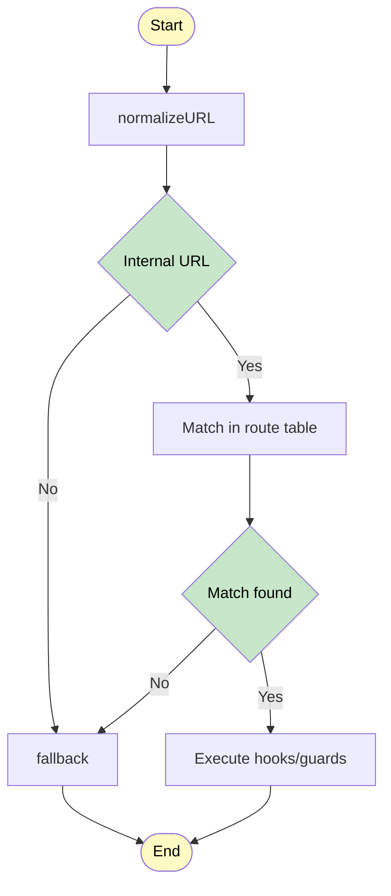

<div align="center">
  
  <h1>@esmx/router</h1>
  
  <div>
    <a href="https://www.npmjs.com/package/@esmx/router">
      
    </a>
    <a href="https://github.com/esmnext/esmx/actions/workflows/build.yml">
      
    </a>
    <a href="https://esmx.dev/coverage/">
      
    </a>
    <a href="https://nodejs.org/">
      
    </a>
    <a href="https://bundlephobia.com/package/@esmx/router">
      
    </a>
  </div>
  
  <p>A universal, framework-agnostic router that works seamlessly with modern frontend frameworks</p>
  
  <p>
    English | <a href="https://github.com/esmnext/esmx/blob/master/packages/router/README.zh-CN.md">中文</a>
  </p>
</div>

## 🚀 Features

- **Framework Agnostic** - Works with any frontend framework (Vue, React, Preact, Solid, etc.)
- **Universal Support** - Runs in both browser and Node.js environments
- **TypeScript Ready** - Full TypeScript support with excellent type inference
- **High Performance** - Optimized for production use with minimal bundle size
- **SSR Compatible** - Complete SSR support
- **Modern API** - Clean and intuitive API design

## 📦 Installation

```bash
# npm
npm install @esmx/router

# pnpm
pnpm add @esmx/router

# yarn
yarn add @esmx/router
```

## 🚀 Quick Start

```typescript
import { Router, RouterMode } from '@esmx/router';

// Create router instance
const router = new Router({
  appId: 'app', // Application mount container ID (optional, defaults to 'app')
  mode: RouterMode.history,
  routes: [
    { path: '/', component: () => 'Home Page' },
    { path: '/about', component: () => 'About Page' }
  ]
});

// Navigate to route
await router.push('/about');
```

## 📚 Documentation

Visit the [official documentation](https://esmx.dev) for detailed usage guides and API reference.

### Route Navigation Flow



#### Route Hook Pipeline

|  | fallback | override | beforeLeave | beforeEach | beforeUpdate | beforeEnter | asyncComponent | confirm |
|---------|----------|----------|-------------|------------|--------------|-------------|----------------|---------|
| `push` | ✅ | ✅ | ✅ | ✅ | ✅ | ✅ | ✅ | ✅ |
| `replace` | ✅ | ✅ | ✅ | ✅ | ✅ | ✅ | ✅ | ✅ |
| `pushWindow` | ✅ | ✅ | ❌ | ✅ | ❌ | ❌ | ❌ | ✅ |
| `pushLayer` | ✅ | ✅ | ❌ | ✅ | ❌ | ❌ | ❌ | ✅ |
| `replaceWindow` | ✅ | ✅ | ✅ | ✅ | ❌ | ❌ | ❌ | ✅ |
| `restartApp` | ✅ | ❌ | ✅ | ✅ | ✅ | ✅ | ✅ | ✅ |
| `unknown` | ✅ | ❌ | ✅ | ✅ | ✅ | ✅ | ✅ | ✅ |

```mermaid
gantt
  title Route Hook Execution Comparison
  dateFormat X
  axisFormat %s
  section push\nreplace
    fallback      :0, 1
    override      :1, 2
    beforeLeave   :2, 3
    beforeEach    :3, 4
    beforeUpdate  :4, 5
    beforeEnter   :5, 6
    asyncComponent:6, 7
    confirm       :7, 8
  section pushWindow\npushLayer
    fallback      :0, 1
    override      :1, 2
    beforeEach    :3, 4
    confirm       :7, 8
  section replaceWindow
    fallback      :0, 1
    override      :1, 2
    beforeLeave   :2, 3
    beforeEach    :3, 4
    confirm       :7, 8
  section restartApp\nunknown
    fallback      :0, 1
    beforeLeave   :2, 3
    beforeEach    :3, 4
    beforeUpdate  :4, 5
    beforeEnter   :5, 6
    asyncComponent:6, 7
    confirm       :7, 8
```



#### Hook Functions

- **fallback**: Handle unmatched routes
- **override**: Allow route override logic
- **beforeLeave**: Execute before leaving current route
- **beforeEach**: Global navigation guard
- **beforeUpdate**: Execute before route update (same component)
- **beforeEnter**: Execute before entering new route
- **asyncComponent**: Load async component
- **confirm**: Final confirmation and navigation execution

#### Navigation Types

- **Standard Navigation** (`push`, `replace`): Execute full hook chain
- **Window Operations** (`pushWindow`, `replaceWindow`): Simplified hook chain for window-level navigation
- **Layer Operations** (`pushLayer`): Minimal hook chain for layer navigation
- **App Restart** (`restartApp`): Full hook chain but skip override
- **Unknown Type** (`unknown`): Full hook chain but skip override, used as default handling

## 📄 License

MIT © [Esmx Team](https://github.com/esmnext/esmx)
