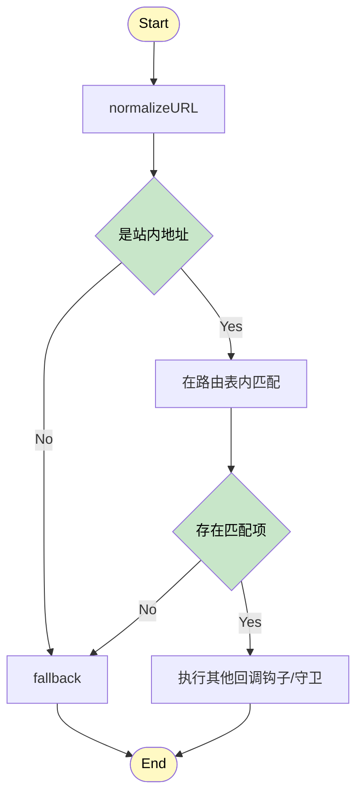

<div align="center">
  
  <h1>@esmx/router</h1>
  
  <div>
    <a href="https://www.npmjs.com/package/@esmx/router">
      
    </a>
    <a href="https://github.com/esmnext/esmx/actions/workflows/build.yml">
      
    </a>
    <a href="https://www.esmnext.com/coverage/">
      
    </a>
    <a href="https://nodejs.org/">
      
    </a>
    <a href="https://bundlephobia.com/package/@esmx/router">
      
    </a>
  </div>
  
  <p>通用的框架无关路由器，与现代前端框架无缝协作</p>
  
  <p>
    <a href="https://github.com/esmnext/esmx/blob/master/packages/router/README.md">English</a> | 中文
  </p>
</div>

## 🚀 特性

- **框架无关** - 适用于任何前端框架（Vue、React、Preact、Solid 等）
- **通用支持** - 在浏览器和 Node.js 环境中运行
- **TypeScript 就绪** - 完整的 TypeScript 支持，出色的类型推断
- **高性能** - 为生产环境优化，最小化包体积
- **SSR 兼容** - 完整的服务端渲染支持
- **现代 API** - 简洁直观的 API 设计

## 📦 安装

```bash
npm install @esmx/router
```

## 🚀 快速开始

```typescript
import { Router, RouterMode } from '@esmx/router';

// 创建路由器实例
const router = new Router({
  root: '#app', // 浏览器环境中必需
  mode: RouterMode.history,
  routes: [
    { path: '/', component: () => '首页' },
    { path: '/about', component: () => '关于页面' }
  ]
});

// 导航到路由
await router.push('/about');
```

## 📚 文档

访问[官方文档](https://www.esmnext.com)获取详细的使用指南和 API 参考。

### 路由导航时大致的流程说明



#### 路由钩子管道

|  | fallback | override | beforeLeave | beforeEach | beforeUpdate | beforeEnter | asyncComponent | confirm |
|---------|----------|----------|-------------|------------|--------------|-------------|----------------|---------|
| `push` | ✅ | ✅ | ✅ | ✅ | ✅ | ✅ | ✅ | ✅ |
| `replace` | ✅ | ✅ | ✅ | ✅ | ✅ | ✅ | ✅ | ✅ |
| `pushWindow` | ✅ | ✅ | ❌ | ✅ | ❌ | ❌ | ❌ | ✅ |
| `pushLayer` | ✅ | ✅ | ❌ | ✅ | ❌ | ❌ | ❌ | ✅ |
| `replaceWindow` | ✅ | ✅ | ✅ | ✅ | ❌ | ❌ | ❌ | ✅ |
| `restartApp` | ✅ | ❌ | ✅ | ✅ | ✅ | ✅ | ✅ | ✅ |
| `unknown` | ✅ | ❌ | ✅ | ✅ | ✅ | ✅ | ✅ | ✅ |

```mermaid
gantt
  title 路由钩子执行对比
  dateFormat X
  axisFormat %s
  section push<br>replace
    fallback      :0, 1
    override      :1, 2
    beforeLeave   :2, 3
    beforeEach    :3, 4
    beforeUpdate  :4, 5
    beforeEnter   :5, 6
    asyncComponent:6, 7
    confirm       :7, 8
  section pushWindow<br>pushLayer
    fallback      :0, 1
    override      :1, 2
    beforeEach    :3, 4
    confirm       :7, 8
  section replaceWindow
    fallback      :0, 1
    override      :1, 2
    beforeLeave   :2, 3
    beforeEach    :3, 4
    confirm       :7, 8
  section restartApp<br>unknown
    fallback      :0, 1
    beforeLeave   :2, 3
    beforeEach    :3, 4
    beforeUpdate  :4, 5
    beforeEnter   :5, 6
    asyncComponent:6, 7
    confirm       :7, 8
```



#### 钩子函数说明

- **fallback**: 处理未匹配的路由
- **override**: 允许路由重写逻辑
- **beforeLeave**: 离开当前路由前执行
- **beforeEach**: 全局导航守卫
- **beforeUpdate**: 路由更新前执行（相同组件）
- **beforeEnter**: 进入新路由前执行
- **asyncComponent**: 加载异步组件
- **confirm**: 最终确认和导航执行

#### 路由类型特点

- **标准导航** (`push`、`replace`): 执行完整的钩子链
- **窗口操作** (`pushWindow`、`replaceWindow`): 简化的钩子链，主要用于窗口级别的导航
- **层级操作** (`pushLayer`): 最简化的钩子链，用于层级导航
- **应用重启** (`restartApp`): 完整钩子链但跳过 override
- **未知类型** (`unknown`): 完整钩子链但跳过 override，作为默认处理

## 📄 许可证

MIT © [Esmx Team](https://github.com/esmnext/esmx)
