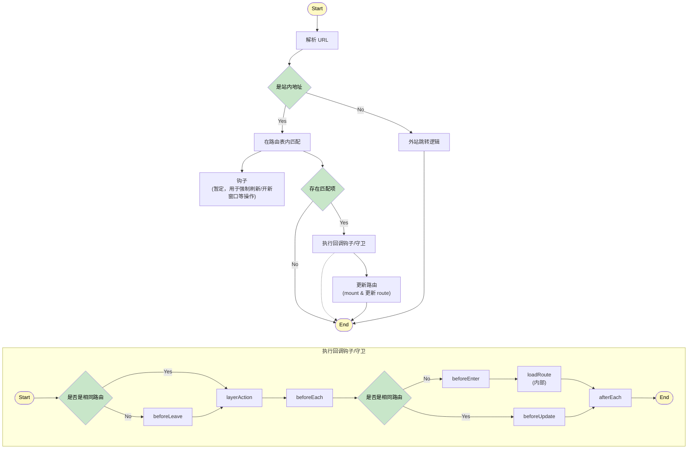

# Esmx 路由库设计

作为新一代的微前端框架，ESMX 提供了一个路由解决方案，在兼容市面上现有路由的同时，可以应对更为复杂的使用场景。

## 微前端场景

### 问题背景

1. 在大型前端应用开发中，不同业务团队可能使用不同的技术栈。一个团队可能偏好 Vue，而另一个团队可能更熟悉 React。微前端路由支持可以让这些不同技术栈的应用无缝集成，使用户体验保持一致。
2. 传统的微前端路由解决方案一次只允许存在和展示有且只有一个同级路由。考虑场景：需要在 微应用A 中浮窗展示 微应用B。微应用AB如果是同级路由，则传统方案没有能力进行处理。

### 解决方案

为了解决上述问题，ESMX 路由库设计了以下解决方案：

1. **路由共存**：通过支持同级路由的共存，允许多个同级微应用同时渲染。例如，在 微应用A 中可以以浮窗的形式展示同级 微应用B，但不破坏当前的路由历史。
2. **技术栈无关性**：通过抽象路由层，支持不同技术栈（如 Vue、React）的微应用无缝集成，确保用户体验一致。
3. **动态加载与销毁**：支持微应用的动态加载与销毁，确保资源的高效利用，避免内存泄漏。
4. **服务端渲染支持**：提供服务端渲染能力，确保 SEO 和首屏加载性能。
5. **隔离与共享**：通过路由上下文管理，实现微应用之间的状态隔离，同时支持事件穿透和共享。
6. **无刷新导航**：通过路由库的统一管理，实现无刷新导航，提升用户体验。

这些特性使得 ESMX 路由库能够满足复杂的微前端场景需求，同时保持高性能和灵活性。

### 实现示例

```ts
// 路由应用注册器
interface RouterRegisterApp {
  // 应用挂载函数
  mount: () => void;
  // 应用销毁函数
  unmount: () => void;
  // 服务端渲染时的渲染函数
  renderToString?: () => string;
}

const router = new Router({
  initUrl: '/',
  routes: [{
    path: '/',
    appType: 'vue2',
    component: Home
  }, {
    path: '/setting',
    appType: 'vue3',
    component: Setting
  }, {
    path: '/about',
    appType: 'React',
    component: About
  },],
});

// 初始化路由
await router.init();
// 更新路由
await router.push('/about');
// 路由共存
await router.pushLayer('/setting');
// 服务端渲染时调用
await router.renderToString?.();
```

## 跨站点URL转换

### 问题背景

在全球化业务场景中，可能期望用户通过不同的域名来访问相同内容，例如提供了不同的区域站点：国际站（www.esmx.com）、中国站（www.esmx.cn）、印尼站（www.esmx.co.id）。这带来以下挑战：

1. **内容分享障碍**：用户生成的内容（如分享链接）在不同区域站点展示和访问时无法自动适配
2. **导航体验差**：区域切换通常需要页面重载，影响用户体验

### 解决方案

通过URL转换功能实现：

1. **智能URL转换**：自动将跨区域URL转换为当前站点的相对路径
2. **无刷新导航**：保持单页应用状态，提升用户体验

### 实现示例

```ts
/**
 * URL转换配置
 * 功能：将支持的跨区域URL转换为当前站点的相对路径
 */
const router = new Router({
  baseURL: new URL('https://www.esmx.cn'),
  normalizeURL({ url, router }: { url: URL; router: RouterInstance; }) {
    // 支持的域名列表（国际站、中国站、印尼站）
    const supportedDomains = [
      'www.esmx.com',   // 国际站
      'www.esmx.cn',    // 中国站
      'www.esmx.co.id'  // 印尼站
    ];

    // 仅转换支持的域名
    if (supportedDomains.includes(url.hostname)) {
      /**
       * 转换逻辑：
       * 1. 保留原始路径和查询参数
       * 2. 使用当前站点域名重建URL
       * 3. 保持单页应用的无刷新体验
       */
      const fullPath = url.href.substring(
        url.href.indexOf(url.host) + url.host.length
      );
      return new URL(fullPath, router.options.baseURL);
    }

    // 非支持域名（如第三方链接）保持原样
    return url;
  }
});
```

### 实际应用价值

1. **内容分享**：国际站产品链接在中国站自动转换
   - 转换前：`https://www.esmx.com/products?id=123`
   - 转换后：`https://www.esmx.cn/products?id=123`
2. **内容管理**：印尼站关于页面在中国站自动适配
   - 转换前：`https://www.esmx.co.id/about`
   - 转换后：`https://www.esmx.cn/about`
3. **外部链接保护**：第三方链接保持不变
   - 如：`https://www.google.com` → 保持不变


## 站外URL场景

绝大部分路由库，仅支持应用内路由跳转，但是对于外站跳转，几乎所有的推荐实践都是通过直接使用 `<a>` 标签来处理，或者通过复杂的守卫或钩子来进行额外的处理。

我们希望能有这样一个路由库，它能内置逻辑处理外站跳转，同时也支持用户以直观的方式自定义外站跳转逻辑。

```ts
const router = new Router({
  externalUrlHandler({ url, router }: { url: URL; router: RouterInstance; }) {
    if (url.hostname !== 'www.some-website-you-trusted.com') {
      const ok = window.confirm('您即将访问不安全的网站，是否继续？');
      if (ok) {
        window.open(url.href);
        return true; // 阻止路由库的默认逻辑
      }
    }
    // 返回 非真 值 则表示继续使用路由库的默认逻辑继续处理
    return false;
  }
});
// 站内跳转
router.push('/about');
// 站外跳转
router.push('https://www.google.com');
```

## 接口设计

现在整体逻辑会分为几个阶段：

1. 解析 URL
2. 在路由表中匹配
3. 执行回调钩子/守卫
   1. 不同框架和注册器自己的处理
4. 操作 history 之类的实际行为，并 更新路由（mount和变更 route）

挂载组件之类的，是通过监听 route 变化来进行的。

构建路由时选项：

```ts
export interface RouterOptions {
  /**
   * 基础URL配置，用于处理多语言、多区域等场景的路由前缀。
   * 必须是一个URL对象，例如：new URL('/zh-CN', window.location.origin)
   */
  baseURL?: URL;

  /**
   * 初始URL配置，指定路由库初始化时应用的起始路径。路由实例创建后将首先导航到此URL。
   * @default '/'
   */
  initURL?: string;

  /**
   * URL规范化函数，用于实现跨区域无刷新导航。此函数可以将不同格式的区域URL（包括子域名和路径格式）
   * 统一转换为标准的内部路由格式，从而实现统一的路由管理和无缝的用户体验。
   */
  normalizeURL?: (context: {
    url: URL;
    router: RouterInstance;
  }) => URL | Promise<URL>;

  /**
   * 自定义外部链接处理函数。返回 `true` 表示已处理，返回 `false` 则继续使用默认策略。
   * 目前的默认策略是根据 `replace` 来决定是当前标签页还是新标签页打开。
   */
  externalUrlHandler?: (context: {
    url: URL;
    router: RouterInstance;
    replace: boolean;
  }) => boolean | Promise<boolean>;

  /**
   * 路由中全局上下文。在导航时会和单次导航任务的上下文对象合并，导航任务上下文的优先级会更高。
   */
  context: Object;
}
```

路由实例：

```ts
interface RegisterConfig {
  // 应用挂载函数
  mount: () => void;
  // 应用销毁函数
  unmount: () => void;
  // 服务端渲染时的渲染函数
  renderToString?: () => string;
}

interface RouterInstance {
  init(options?: RouterInitOptions);
  register(name: string, config: (router: RouterInstance): RegisterConfig);
  push: {
    (url: string | URL, options: {}): Promise<void>;
  };
  replace();
  reload();
  forceReload();
  pushWindow();
  pushLayer();
  renderToString();
}
```

新添加的 pushLayer 方法：

```ts
/**
 * 路由跳转等事件使用的参数
 */
type RouterLocation = ({
  path: URL;
} | {
  path?: string;
  query?: Record<string, any>;
  queryArray?: Record<string, any[]>;
  hash?: string;
}) & {
  params?: Record<string, any>;
  state?: HistoryState;
};

interface RouterAction {
  /**
   * 设置此参数后，不保存滚动位置，跳转后页面位置仍在原处
   */
  keepScrollPosition?: boolean;
  /**
   * 在 hooks 里，可以改变导航方式（通过新启动一个导航并终止当前导航来实现）
   * @example
   * hooks: {
   *   beforeEach(to) {
   *       if (to.type === 'push') {
   *         // 将所有 push 都变为 pushLayer
   *         router.pushLayer(to, { hooks });
   *         // 返回 false 以取消当前导航
   *         return false;
   *       }
   *   }
   * }
   */
  hooks: {
    beforeEach?: NavigationGuard;
    afterEach?: NavigationGuardAfter;
    beforeEnter?: NavigationGuard;
    beforeUpdate?: NavigationGuard;
    beforeLeave?: NavigationGuard;
  };
}

type PushReturn = {
  /**
   * 关闭的类型。
   * `back`：表明是通过路由back触发的关闭
   * `close`：表明是通过close触发的关闭
   */
  type: 'back' | 'close';
  /**
   * 关闭时 layer 返回的数据
   */
  data: any;
};

type PushLayer = {
  (url: RouterLocation['path'], options?: RouterLocation & RouterAction): Promise<PushReturn>;
  (options: RouterLocation & RouterAction): Promise<PushReturn>;
};

/**
 * 路由实例上的方法，用于关闭 layer
 */
type CloseLayer = {
  (opt: {
    /**
     * 关闭的类型。
     * `back`：表明是通过路由back触发的关闭
     * `close`(default)：表明是通过close触发的关闭
     */
    type: 'back' | 'close';
    /**
     * 关闭时 layer 返回的数据
     */
    data: any;
    /**
     * 对后代 layer 的策略：
     * * `clear`(default)：关闭所有后代 layer
     * * `hoisting`：将直接子 layer 挂载到直接父 layer 上
     */
    descendantStrategy: 'clear' | 'hoisting';
  }): void;
}
```

1. pushLayer 后，所有的路由都切换到内存模式，此时浏览器 URL 的变更和 UI 的更新脱节。
   此时对于顶层非 layer 模式打开的页面，会在其下所有的 layer 都被关闭才还原回非内存模式，期间产生的所有记录都会同步到其 history 中。
2. 每个 layer 都有父layer，不存在例外。关闭时，如果存在子layer，则可以决定是关闭所有子layer，还是不关闭，不关闭时会将子layer的父layer指向当前layer的父layer。
3. 每个单独的layer都是一个单独的路由实例
4. 提供一个可以改变浏览器 URL 的便捷方法


路由添加上下文选项
跨区域 改return例子

同域
  应用控制
  非应用内控制
    单独注册一个应用去处理
不同域


1. 路由添加上下文选项
2. 跨区域 改return例子
3. 同域情况下 通过路由配置是否由应用来控制
4. 同域 非应用内控制 路由表匹配之后添加一个钩子 允许强刷页面或新开窗口
5. state/ctx  可与全局options里的合并
6. 在beforeEach之前加一个是否关闭layer的钩子
7. push的返回值

router.rootContext
router.
  
  // context


  router.push('https://baidu.com', {
    webOpen: false,
    appOpen: true,
  })


router.pushLayer('', {
  hooks: {}
})




update({ type: 'push' })
update({ type: 'push-layer' })
update({ type: 'push-window' })
update({ type: 'replace' })
update({ type: 'reload' })

// 无刷新
push
replace
reload
layer
// 页面强刷
force-reload
// 新窗口打开
push-window

router.push()
router.replace()
router.reload()
router.forceReload()
router.pushWindow()
router.pushLayer()

1. error 跳转的地址，被终止
2. updated
3. 打开层，操作成功，操作失败
4. hybrid
layer
 close
 success
 data
 goUrl


router.pushLayer({
  canClose (route, router) {
    router.layerResult = { ...router.layerResult }
    return router.layerResult !== null
  }
});


// 成功
// GoToTrade
// router.closeLayer({});

hooks:
if (url === 风险提示)
layerRouter.close()
rootRouter.push(url)


// opts
{
    hybrid: 'app'
}
// routeRule
{
    path: '/u/:id'
    hybrid: {
        app: {
            canUse: () => version > 6500,
            hans() {
                (route) => {
                    return native('ssss', { id: route.params.id })
                }
            }
        },
        'zhu': () => {

        }
    }
}

router.push('/u/1000');
router.context
router.layerParams
router.layerReturn;

router.pushLayer('/');
